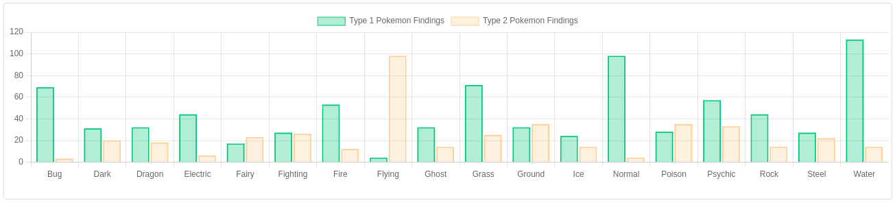
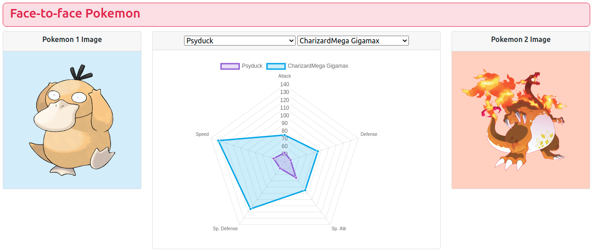

# Chart.js-Pokemon Data Visualization
Having fun with Pokemon and Chart.js

This visualization explores the use of chart js to chart a simple dataset that contains 721+ pokemons.

## Bar charts for Types 1 & 2.

The first is a bar chart that plots the number of pokemons according to their types 1 and 2 individually.

## Face-to-face pokemon

The second visualizations add interactivity to select a pokemon name from 2 different list selectors. Then using javascript it finds the selected pokemons to plot a radar chart and explore their stats to comapare both.

